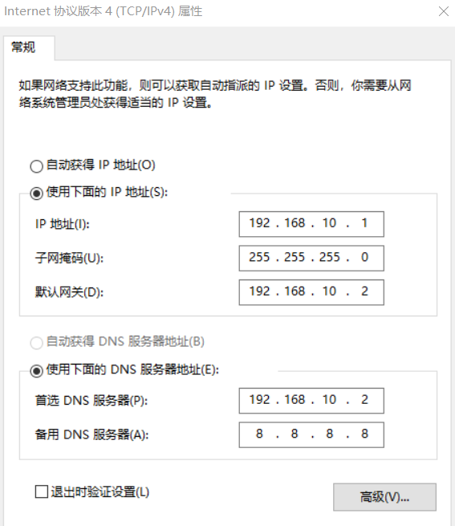

<style>
.copy-btn {
  position: absolute;
  top: 0;
  right: 0;
  background-color: #011627;
  border: none;
  border-radius: 3px;
  padding: 5px;
  cursor: pointer;
  font-family: 'Times New Roman';
}
</style>

<script>
document.addEventListener('DOMContentLoaded', (event) => {
  // 创建复制到剪贴板的函数
  function copyToClipboard(str) {
    const el = document.createElement('textarea');
    el.value = str;
    document.body.appendChild(el);
    el.select();
    document.execCommand('copy');
    document.body.removeChild(el);
  };

  // 为每个代码块添加复制按钮
  document.querySelectorAll('pre code').forEach((block) => {
    const btn = document.createElement('button');
    btn.className = 'copy-btn';
    btn.textContent = 'Copy';
    btn.addEventListener('click', () => {
      // 复制文本到剪贴板
      copyToClipboard(block.textContent);
      // 更新按钮文本为 "Copied"
      btn.textContent = 'Copied';
      // 设置两秒后恢复按钮文本
      setTimeout(() => {
        btn.textContent = 'Copy';
      }, 2000); // 2000 毫秒后执行
    });
    block.parentNode.appendChild(btn);
  });
});
</script>

```{r setup, include=FALSE}
setwd("D:/Java_workspace/LinuxLearning")
knitr::opts_chunk$set(echo = TRUE)
options(warn = -1)
```

# VMWare

# root用户相关
设置用户密码：
```bash
sudo passwd root
```

切换到root用户，输入下述命令，然后键入密码。
```bash
su root
```


# 虚拟机组成
## 硬件
我的联想电脑的CPU核心数为12。`虚拟机运行数量` * `每个虚拟机CPU数` * `每个CPU核心数` 不要超过12。

## IP
### 设置VMWare的IP地址
VMWare中，点击`编辑`->`虚拟网络编辑器`，会看见VMnet1和VMnet8。选中VMnet8，点击`更改设置`。再次点击`编辑`->`虚拟网络编辑器`，会看见VMnet0，VMnet1和VMnet8。选中VMnet8，可以将子网IP第三个八位字节设置为10（如192.168.10.0）。点击NAT设置，将网关IP也同样设置（网关IP的第四个八位字节一般是2）。最后，点击`虚拟网络编辑器`中的确定。

### 本机Windows中设置VMnet8的地址
在本机中，点击`以太网`->`更改适配器选项`->`VMWare Network Adapter VMnet8`->`属性`->`Internet协议版本 4`。按照下图配置。



### 虚拟机内部设置IP地址
打开文件。如果识别不出vim命令，则需要下载`apt install vim`。
```bash
su root
sudo vim /etc/netplan/01-netcfg.yaml
```

键入`i`进入编辑模式。

```yaml
network:
  version: 2
  renderer: networkd
  ethernets:
    ens33:
      dhcp4: no
      addresses:
        - 192.168.10.100/24
      gateway4: 192.168.10.2
      nameservers:
        addresses:
          - 192.168.10.2
```

按`Esc`，再键入`:wq`可以保存修改的内容。

应用更改：

```bash
sudo netplan apply
```

建立IP地址与主机名的映射关系：

```bash
sudo vim /etc/hosts
```

增加下述内容：

```
192.168.10.100 hadoop100
192.168.10.101 hadoop101
192.168.10.102 hadoop102
192.168.10.103 hadoop103
192.168.10.104 hadoop104
192.168.10.105 hadoop105
192.168.10.106 hadoop106
192.168.10.107 hadoop107
192.168.10.108 hadoop108
```

1. 使用`ipconfig`检查ens33部分的内容，查看inet是否为`192.168.10.100`。

2. 然后再`ping www.baidu.com`看看是否能访问外网。

3. `hostname`查看主机名称是否为hadoop100


