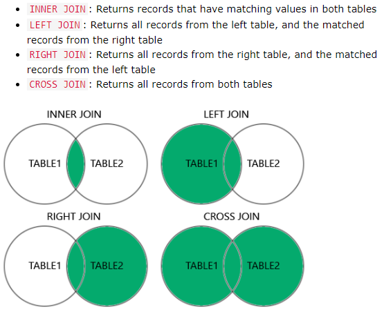

```{r setup, include=FALSE}
knitr::opts_chunk$set(echo = TRUE)
options(warn = -1)
```

```{r include=FALSE}
setwd("D:/Java_workspace/SQLLearning")

library(knitr)
library(kableExtra)
```

# MySQL Basic
## Log in to MySQL
```{bash eval=FALSE}
mysql -u root -p
```

## Create/Drop a database
Create a database, a user and his privileges.

```{sql connection=FALSE, eval=FALSE, include=TRUE}
CREATE DATABASE my_database_name;
```

```{sql connection=FALSE, eval=FALSE, include=TRUE}
DROP DATABASE my_database_name;
```

## Create/Drop a user
Create a user and his privileges.

```{sql connection=FALSE, eval=FALSE, include=TRUE}
CREATE USER 'springuser'@'%' IDENTIFIED BY '123456'; -- Create the user
GRANT ALL ON db_example.* TO 'springuser'@'%'; -- Give all privileges to the new user 
```

`springuser` is the user name; `'%'` is a wildcard which means that the user name can be logged in at whatever hostname or ip. And `'%'` can be either `'localhost'` or `'192.168.1.100'` which will limit the log in privilege.

`123456` is the password of user "springuser".

```{sql connection=FALSE, eval=FALSE, include=TRUE}
SELECT user FROM mysql.user;
DROP user 'springuser'@'%';
```

## Create/Drop/ALTER a table
```{sql connection=FALSE, eval=FALSE, include=TRUE}
CREATE TABLE mytable (
id int NOT NULL AUTO_INCREMENT PRIMARY KEY,
name varchar(255) NOT NULL,
email varchar(255));  -- create a table

CREATE TABLE mynewtable AS 
SELECT column1, column2 
FROM mytable
WHERE column1 = 'W';  -- create a table from an old table
```

```{sql connection=FALSE, eval=FALSE, include=TRUE}
DROP TABLE mytable; -- delete the table
TRUNCATE TABLE mytable;  -- clear the table
```

```{sql connection=FALSE, eval=FALSE, include=TRUE}
ALTER TABLE mytable
ADD COLUMN gender varchar(255) NOT NULL DEFAULT 'male'
AFTER name; -- add a new column

ALTER TABLE mytable
DROP COLUMN gender;  -- drop a column

ALTER TABLE mytable
MODIFY COLUMN gender char(1);  -- change data type of a column
```

# CONSTRAINT
- `NOT NULL`: a column cannot have a NULL value

- `UNIQUE`: all values in a column are different.

- `PRIMARY KEY`: `NOT NULL` + 'UNIQUE'

- `CHECK`: ensure values in a column satisfies a specific condition

- `DEFAULT`:

- `CREATE INDEX`: use to create and retrieve data from database very quickly.

## UNIQUE
The constraint name is "UC_mytable". The column `id` and `name` are constrained as `UNIQUE`.

```{sql connection=FALSE, eval=FALSE, include=TRUE}
CREATE TABLE mytable (
id int NOT NULL,
name varchar(255),
email varchar(255),
CONSTRAINT UC_mytable UNIQUE (id, name));  -- use constraint when creating a table

ALTER TABLE mytable
ADD CONSTRAINT UC_mytable UNIQUE (id, name);  -- use constraint when altering a table

ALTER TABLE mytable
DROP INDEX UC_mytable;
```

## PRIMARY KEY
A table can only have one `PRIMARY KEY`. But `PRIMARY KEY` can be made of more than one different columns.

```{sql connection=FALSE, eval=FALSE, include=TRUE}
CREATE TABLE mytable (
id int NOT NULL,
name varchar(255) NOT NULL,
email varchar(255),
CONSTRAINT UC_mytable PRIMARY KEY (id, name));  -- use constraint when creating a table

ALTER TABLE mytable
ADD CONSTRAINT PK_mytable PRIMARY KEY (id, name);  -- use constraint when altering a table

ALTER TABLE mytable
DROP PRIMARY KEY;
```

## FOREIGN KEY
```{sql connection=FALSE, eval=FALSE, include=TRUE}
CREATE TABLE table1 (
id INT NOT NULL,
name VARCHAR(225) NOT NULL,
PRIMARY KEY (id));

CREATE TABLE table2 (
id INT NOT NULL,
email VARCHAR(255) NOR NULL,
FOREIGN KEY (id) REFERENCES table1(id));  -- foreign key in table2 pointing to primary key in table1.

ALTER TABLE table
ADD CONSTRAINT FK_table2 
FOREIGN KEY (id) REFERENCES table1(id);  -- add a foreign key

ALTER TABLE table2
DROP FOREIGN KEY FK_mytable2;  -- drop a foreign key
```

table1:
```{r echo=FALSE, warning=FALSE}
mydf <- data.frame(
  column1 = c("$id$", "$name$"),
  column2 = c('$1$', '$ZT$'),
  column3 = c('$2$', '$WQ$'),
  column4 = c('$3$', '$ZKS$')
)
kable(t(mydf), "html", booktabs = T, col.names = NULL, row.names=F, align = "c") %>%
  kable_styling(bootstrap_options = 'bordered', latex_options = "striped", full_width = F)
```

table2:
```{r echo=FALSE, warning=FALSE}
mydf <- data.frame(
  column1 = c("$id$", "$name$"),
  column2 = c('$1$', '$zouxiaotao@163.com$'),
  column3 = c('$1$', '$894905246@qq.com$'),
  column4 = c('$2$', '$quanwang@163.com$'),
  column5 = c('$3$', '$kuisongzhu@163.com$')
)
kable(t(mydf), "html", booktabs = T, col.names = NULL, row.names=F, align = "c") %>%
  kable_styling(bootstrap_options = 'bordered', latex_options = "striped", full_width = F)
```

If I want to insert a "4, 12345@163.com" into table2, there will throw an error. Because I'm to change the foreign key aligned to primary key (1, 2, 3) only in table1.

## CHECK
```{sql connection=FALSE, eval=FALSE, include=TRUE}
CREATE TABLE mytable (
id int NOT NULL,
name VARCHAR(255),
age int,
CHECK (age>=18));  -- define a CHECK CONSTRAINT without name when creating a table

CREATE TABLE mytable (
id int NOT NULL,
name VARCHAR(255),
age int,
CONSTRAINT CHK_mytable CHECK (age>=18 AND id<10));  -- define a CHECK CONSTRAINT with a name when creating a table
```

```{sql connection=FALSE, eval=FALSE, include=TRUE}
ALTER TABLE mytable
ADD CHECK (age>=18);
--or
ALTER TABLE mytable
ADD CONSTRAINT CHK_mytable CHECK (age>=18 AND id<10);

ALTER TABLE mytable
DROP CHECK CHK_mytable;
```

## CREATE INDEX
```{sql connection=FALSE, eval=FALSE, include=TRUE}
/*INDEX is a kind of data structure which is stored on disk.
It will facilitate: point query, range query, ordering and join. There is no need to scan the whole table for indexed column.
Shortcomings: modifying an indexed column will be slower*/
CREATE INDEX idx_email ON mytable (email);
```

## AUTO_INCREMENT
```{sql connection=FALSE, eval=FALSE, include=TRUE}
CREATE TABLE mytable (
id int NOT NULL AUTO_INCREMENT,
name VARCHAR(255),
PRIMARY KEY (id));

INSERT INTO mytable (name)
VALUES ('ZT');  -- I don't need to INSERT INTO the AUTO_INCREMENT column.
```

# MySQL Data Type
## String data type
```{r echo=FALSE, warning=FALSE}
mydf <- data.frame(
  column1 = c("$Data Type$", "$Description$"),
  column2 = c('$char(size)$', '$fixed length; size\\in\\{0,\\cdots,255(2^8-1)\\}$'),
  column3 = c('$varchar(size)$', '$size\\in\\{0,\\cdots,65535(2^16-1)\\}$')
)
kable(t(mydf), "html", booktabs = T, col.names = NULL, row.names=F, align = "c") %>%
  kable_styling(bootstrap_options = 'bordered', latex_options = "striped", full_width = F)
```

# INSERT
```{sql connection=FALSE, eval=FALSE, include=TRUE}
INSERT INTO my_database_name.my_table_name (id, email, name)
VALUES 
(1, 'zouxiaotao886@163.com', 'Tom ZOU'),
(2, '1234546789@qq.com', 'Jack Smith');
```

```{sql connection=FALSE, eval=FALSE, include=TRUE}
INSERT INTO mytable1 (id, email, name)
SELECT id, email, name FROM mytable2;
```

# SELECT
## DISTINCT
```{sql connection=FALSE, eval=FALSE, include=TRUE}
SELECT DISTINCT * FROM mytable; -- select different rows.
```

mytable:
```{r echo=FALSE, warning=FALSE}
mydf <- data.frame(
  column1 = c("$Column1$", "$Column2$"),
  column2 = c('$A$', '$X$'),
  column3 = c('$A$', '$Y$'),
  column4 = c('$B$', '$Z$'),
  column5 = c('$C$', '$Z$'),
  column6 = c('$A$', '$Z$'),
  column7 = c('$B$', '$Z$')
)
kable(t(mydf), "html", booktabs = T, col.names = NULL, row.names=F, align = "c") %>%
  kable_styling(bootstrap_options = 'bordered', latex_options = "striped", full_width = F)
```

result:
```{r echo=FALSE, warning=FALSE}
mydf <- data.frame(
  column1 = c("$Column1$", "$Column2$"),
  column2 = c('$A$', '$X$'),
  column3 = c('$A$', '$Y$'),
  column4 = c('$B$', '$Z$'),
  column5 = c('$C$', '$Z$'),
  column6 = c('$A$', '$Z$')
)
kable(t(mydf), "html", booktabs = T, col.names = NULL, row.names=F, align = "c") %>%
  kable_styling(bootstrap_options = 'bordered', latex_options = "striped", full_width = F)
```

## ORDER BY
```{sql connection=FALSE, eval=FALSE, include=TRUE}
-- ORDER BY clause
-- DESC clause means to sort reversely
SELECT column1, column2, column3
FROM myBD
ORDER BY column2 DESC, column3 ASC;
```

## WHERE
```{sql connection=FALSE, eval=FALSE, include=TRUE}
-- WHERE clause
-- Some WHERE clause operators: >, >=, !=, =
-- ORDER BY clause should be placed behind WHERE
SELECT column1, column2, column3
FROM mytable
WHERE column1 BETWEEN 1 AND 10;

SELECT mytable, column2, column3
FROM myBD
WHERE column1 IS NULL AND column2 IS NOT NULL;

-- When don't use "()", AND is prior to OR
SELECT column1, column2, column3
FROM mytable
WHERE column1 IN (1, 0) OR column2 = 0 AND NOT column3 < 100;

SELECT column1, column2, column3
FROM mytable1
WHERE column1 IN (SELECT column1 FROM mytable2);
```

## LIMIT
`LIMIT` can specify the number of records to return. It is useful on large tables.

```{sql connection=FALSE, eval=FALSE, include=TRUE}
SELECT * FROM my_table_name
WHERE column1='A'
LIMIT 3;  -- Show the first three records.

SELECT * FROM my_table_name
WHERE column1='A'
LIMIT 3 OFFSET 3;  -- Show the records 4 5 6.
```

## LIKE(wildcard)
```{sql connection=FALSE, eval=FALSE, include=TRUE}
-- % represents a set of character including " " and "".
-- _ represents one character including " ".
-- A returned example: 'Fish bean bay toy'
-- Keep in mind that pattern doesn't split strings. It just match and return the whole content.
SELECT column1, column2, column3
FROM myBD
WHERE column1 LIKE 'F_sh%';
```

```{sql connection=FALSE, eval=FALSE, include=TRUE}
SELECT column1, column2, column3
FROM myBD
WHERE column1 LIKE '%_%_%';  -- Match value that contains at least two characters.
```

## REGEXP(regular expression)
```{sql connection=FALSE, eval=FALSE, include=TRUE}
-- I can also use regular expression through clause REGEXP
SELECT column1, column2, column3
FROM myBD
WHERE column1 REGEXP '^[FK]';
```

## select two tables
The results of two columns will be boardcasted together. 

```{sql connection=FALSE, eval=FALSE, include=TRUE}
SELECT t1.column1, t2.column2
FROM table1 AS t1, table2 AS t2;
```

# UPDATE/DELETE
```{sql connection=FALSE, eval=FALSE, include=TRUE}
UPDATE my_table_name
SET column1 = 'Z', column = 'T'
WHERE column3 = 'W';  -- The WHERE clause should not be omitted usually.
```

```{sql connection=FALSE, eval=FALSE, include=TRUE}
DELETE FROM my_table_name
WHERE column3 = 'W';  -- The WHERE clause should not be omitted usually.
```

# Function
## MIN, MAX
```{sql connection=FALSE, eval=FALSE, include=TRUE}
SELECT MIN(column1)  -- Return the minimum value of column1.
FROM my_table_name
WHERE column3 = 'W';
```

```{sql connection=FALSE, eval=FALSE, include=TRUE}
SELECT MAX(column1) AS maximal_column1
FROM my_table_name
WHERE column3 = 'W';
```

## AVG, SUM
`AVG` and `SUM` are used to deal with numeric column.

```{sql connection=FALSE, eval=FALSE, include=TRUE}
SELECT AVG(column1), SUM(column1)
FROM my_table_name
WHERE column3 = 'W';
```

## COUNT
`COUNT` returns the number of rows that matches a specified criterion.

```{sql connection=FALSE, eval=FALSE, include=TRUE}
SELECT COUNT(column1)
FROM my_table_name
WHERE column3 = 'W';
```

# JOIN/UNION
## JOIN
{width="50%"}

```{sql connection=FALSE, eval=FALSE, include=TRUE}
SELECT * 
FROM table1 AS t1 INNER JOIN table2 AS t2 ON t1.column1=t2.column1;

SELECT * 
FROM table1 AS t1 LEFT JOIN table2 AS t2 ON t1.column1=t2.column1;

SELECT * 
FROM table1 AS t1 RIGHT JOIN table2 AS t2 ON t1.column1=t2.column1;

SELECT * 
FROM table1 AS t1 CROSS JOIN table2 AS t2 ON t1.column1=t2.column1;
```

## UNION
```{sql connection=FALSE, eval=FALSE, include=TRUE}
SELECT column1 FROM table1
UNION
SELECT column2 FROM table2;  -- union distinct values

SELECT column1 FROM table1
UNION ALL
SELECT column2 FROM table2;  -- union all values
```

# GROUP BY/HAVING
```{sql connection=FALSE, eval=FALSE, include=TRUE}
SELECT COUNT(id), country FROM table1
GROUP BY country
HAVING COUNT(id)>2
ORDER BY COUNT(id) DESC;  -- Count number of people from different countries.
```

# EXISTS/ALL/ANY
## EXISTS
`EXISTS` returns TRUE if the subquery returns one or more records.

```{sql connection=FALSE, eval=FALSE, include=TRUE}
SELECT ProductName 
FROM Products
WHERE EXISTS (SELECT ProductID FROM OrderDetails WHERE Quantity = 10);
```

## ALL/ANY
```{sql connection=FALSE, eval=FALSE, include=TRUE}
SELECT ProductName 
FROM Products
WHERE ProductID = ANY (SELECT ProductID FROM OrderDetails WHERE Quantity = 10);
-- For each ProductID, if it equals to one of the ProductID from OrderDetails.
```

```{sql connection=FALSE, eval=FALSE, include=TRUE}
SELECT ProductName 
FROM Products
WHERE ProductID > ALL (SELECT ProductID FROM OrderDetails WHERE Quantity = 10);
-- For each ProductID, if it is larger than all of the ProductID from OrderDetails.
```

# CASE
```{sql connection=FALSE, eval=FALSE, include=TRUE}
SELECT orderid, quantity
CASE
WHEN quantity > 30 THEN '>30'
WHEN quantity = 30 THEN '=30'
ELSE '<30'
END AS quantity_text
FROM orderdetails;
```

Sort by city's name, and sort by country when city's name is null.

```{sql connection=FALSE, eval=FALSE, include=TRUE}
SELECT name, city, country
FROM customers
ORDER BY 
(CASE 
WHEN city IS NULL THEN country
ELSE city
END);
```

# IFNULL
If `IFNULL` meets a NULL, then the NULL will be replaced by a user-defined value.

```{sql connection=FALSE, eval=FALSE, include=TRUE}
SELECT name, IFNULL(weight, 100) / POW(height, 2)
FROM mytable;
```

# VIEW
`VIEW` is a virtual table generated from other table(s). When other table changes, the `VIEW` table will be changed correspondingly.

```{sql connection=FALSE, eval=FALSE, include=TRUE}
-- Create a view
CREATE VIEW my_view AS
SELECT id, name FROM mytable;

-- Update a view
CREATE OR REPLACE VIEW my_view AS
SELECT id, name, gender FROM mytable;

-- Drop a view
DROP VIEW my_view
```


